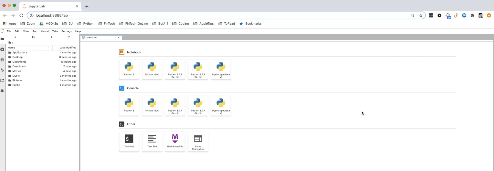

# Crypto Arbitage

This project aims to help high-tech investment firms identify and capitalize on arbitrage opportunities in Bitcoin and other cryptocurrencies. By leveraging the power of Pandas, we can analyze real-time cryptocurrency data, identify price discrepancies between exchanges, and make informed trading decisions. Our solution provides a practical and effective tool to increase profitability by taking advantage of simultaneous price dislocations in cryptocurrency markets.

---

## Technologies

This project leverages python 3.7 and the following libraries:

* [pandas](https://github.com/pandas-dev/pandas) - For the command line interface, help page, and entrypoint.
* [matplot](https://matplotlib.org/stable/tutorials/index.html) - For interactive user prompts and dialogs
* [jupyterlab](https://jupyterlab.readthedocs.io/en/stable/user/interface.html) - For interactive user prompts and dialogs

---

## Installation Guide

Before running the application first install the following dependencies.

```python
  conda activate dev
  jupyter lab
  pandas
```

---

## Usage

To use :

```python
conda list pandas
conda list jupyter
```

Upon launching the jupyter lab notebool you will see the following browser open.




---

## Contributors

Proffesor Firas and Rodalinda Olvera Fernandez

---

## License

Anyone can usetilize this as needed.
